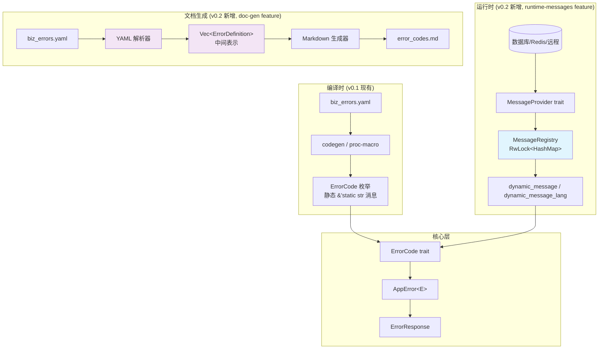
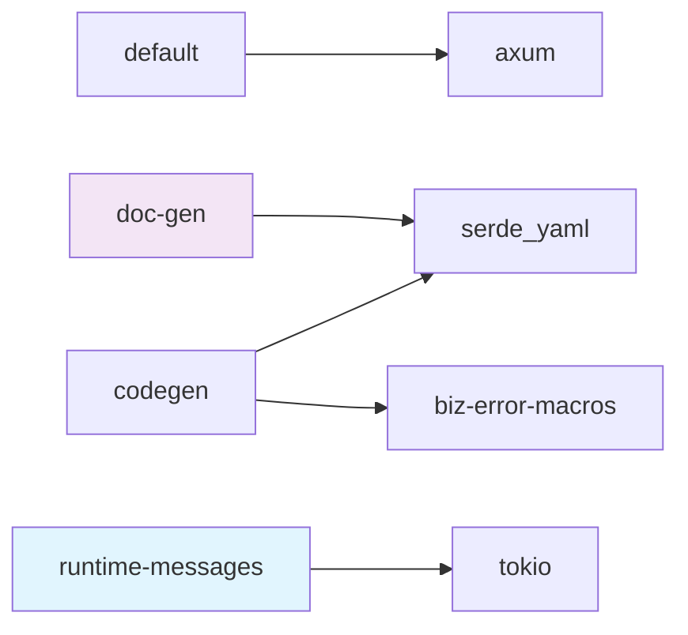

# 技术设计文档: biz-error v0.2 — 数据库动态消息与文档生成

## 概述

biz-error v0.2 在 v0.1 的编译时静态错误码框架基础上，新增两大功能模块：

1. **运行时动态消息（`runtime-messages` feature）**：通过 `MessageProvider` trait 和 `MessageRegistry` 全局注册中心，支持从数据库/Redis/远程配置中心加载错误消息，实现不重编译即可更新消息内容。消息查询采用"动态优先、静态回退"策略。

2. **错误码文档生成（`doc-gen` feature）**：从 YAML 配置文件解析错误码定义，生成结构化 Markdown 文档，包含总览表格、按数字范围分组、多语言消息详情。

两个功能通过独立 feature flag 控制，互不依赖，不影响现有 `default = ["axum"]` 用户。

## 架构

### 整体架构图



### 设计决策

| 决策 | 选择 | 理由 |
|------|------|------|
| 异步 trait 方案 | Rust 原生 async fn in trait (RPITIT) | 项目使用 Rust 2024 edition，原生支持，无需 `async_trait` crate |
| MessageRegistry 存储 | `OnceLock<RwLock<HashMap>>` | `OnceLock` 保证单次初始化，`RwLock` 支持并发读 + 独占写（reload） |
| 动态消息返回类型 | `String`（非 `&str`） | 动态消息来自 HashMap clone，无法返回引用；与静态 `&'static str` 区分 |
| 文档生成中间表示 | `Vec<ErrorDefinition>` 结构体 | 解耦解析与输出，便于未来扩展其他输出格式（HTML、JSON 等） |
| 新方法命名 | `dynamic_message` / `dynamic_message_lang` | 不修改现有 `message()` / `message_lang()` 签名，保持向后兼容 |
| feature flag 粒度 | `runtime-messages` 和 `doc-gen` 独立 | 最小化依赖引入，按需启用 |


## 组件与接口

### 1. MessageProvider trait（`runtime-messages` feature）

```rust
// src/runtime.rs — 条件编译: #[cfg(feature = "runtime-messages")]

/// 运行时消息提供者接口
///
/// 用户为自己的数据源（数据库、Redis、远程配置中心等）实现此 trait。
pub trait MessageProvider: Send + Sync {
    /// 加载单条消息
    ///
    /// - `code`: 错误码数字（如 4000）
    /// - `lang`: 语言标识（如 "zh-CN"）
    /// - 返回 `None` 表示该数据源无此消息
    fn load_message(
        &self,
        code: i32,
        lang: &str,
    ) -> impl Future<Output = Result<Option<String>, Box<dyn std::error::Error + Send + Sync>>>;

    /// 批量加载所有消息
    ///
    /// 返回 `HashMap<(i32, String), String>`，key 为 (错误码, 语言)，value 为消息文本。
    /// 用于应用启动时一次性加载到内存缓存。
    fn load_all_messages(
        &self,
    ) -> impl Future<Output = Result<HashMap<(i32, String), String>, Box<dyn std::error::Error + Send + Sync>>>;
}
```

**设计说明**：
- 使用 Rust 2024 原生 `impl Future` 返回类型（RPITIT），无需 `async_trait`。
- 返回 `Result` 而非裸 `Option`，让调用方能区分"数据源无此消息"和"数据源访问失败"。
- `load_message` 用于按需加载单条（可选的热路径优化），`load_all_messages` 用于启动时批量预热。

### 2. MessageRegistry 全局注册中心（`runtime-messages` feature）

```rust
// src/runtime.rs

use std::collections::HashMap;
use std::sync::{OnceLock, RwLock};

/// 全局消息注册中心
///
/// 管理运行时加载的错误消息缓存。线程安全，支持并发读取和运行时重载。
pub struct MessageRegistry;

// 全局存储
static MESSAGES: OnceLock<RwLock<HashMap<(i32, String), String>>> = OnceLock::new();

impl MessageRegistry {
    /// 初始化注册中心，从 MessageProvider 批量加载消息
    ///
    /// 通常在应用启动时调用一次（如 main 函数或 Axum 的 startup hook）。
    /// 重复调用会覆盖已有数据（等同于 reload）。
    pub async fn init(
        provider: &impl MessageProvider,
    ) -> Result<(), Box<dyn std::error::Error + Send + Sync>> {
        let messages = provider.load_all_messages().await?;
        let store = MESSAGES.get_or_init(|| RwLock::new(HashMap::new()));
        let mut guard = store.write().map_err(|e| format!("RwLock poisoned: {}", e))?;
        *guard = messages;
        Ok(())
    }

    /// 查询消息
    ///
    /// 返回 `Option<String>`。未初始化时返回 `None`，不 panic。
    pub fn get_message(code: i32, lang: &str) -> Option<String> {
        MESSAGES
            .get()?
            .read()
            .ok()?
            .get(&(code, lang.to_string()))
            .cloned()
    }

    /// 重新加载全部消息
    pub async fn reload(
        provider: &impl MessageProvider,
    ) -> Result<(), Box<dyn std::error::Error + Send + Sync>> {
        let messages = provider.load_all_messages().await?;
        let store = MESSAGES.get_or_init(|| RwLock::new(HashMap::new()));
        let mut guard = store.write().map_err(|e| format!("RwLock poisoned: {}", e))?;
        *guard = messages;
        Ok(())
    }
}
```

**设计说明**：
- `OnceLock` 保证 `RwLock<HashMap>` 只分配一次内存。
- `get_message` 在未初始化时安全返回 `None`（`OnceLock::get()` 返回 `None`）。
- `reload` 复用 `init` 逻辑，获取写锁后整体替换 HashMap。
- `get_message` 返回 `Option<String>`（clone），因为 `RwLock` 读守卫的生命周期无法逃逸。

### 3. ErrorCode trait 扩展（`runtime-messages` feature）

```rust
// src/lib.rs — 在现有 ErrorCode trait 定义下方，条件编译追加方法

/// ErrorCode trait 的动态消息扩展
///
/// 启用 `runtime-messages` feature 后可用。
/// 提供"动态优先、静态回退"的消息查询策略。
#[cfg(feature = "runtime-messages")]
pub trait ErrorCodeExt: ErrorCode {
    /// 获取动态消息（默认语言），回退到静态消息
    fn dynamic_message(&self) -> String {
        // 默认语言约定为 "en"，用户可通过 dynamic_message_lang 指定
        self.dynamic_message_lang("en")
    }

    /// 获取指定语言的动态消息，回退到静态消息
    fn dynamic_message_lang(&self, lang: &str) -> String {
        MessageRegistry::get_message(self.code(), lang)
            .unwrap_or_else(|| self.message_lang(lang).to_string())
    }
}

// 为所有实现 ErrorCode 的类型自动实现 ErrorCodeExt
#[cfg(feature = "runtime-messages")]
impl<T: ErrorCode> ErrorCodeExt for T {}
```

**设计说明**：
- 使用独立的 `ErrorCodeExt` 扩展 trait 而非修改 `ErrorCode` trait，避免破坏现有 API。
- blanket impl `impl<T: ErrorCode> ErrorCodeExt for T {}` 让所有错误码枚举自动获得动态消息能力。
- 默认实现在 trait 中提供，用户无需手动实现。

### 4. AppError 动态消息集成（`runtime-messages` feature）

```rust
// src/lib.rs — AppError<E> 的条件编译扩展

impl<E: ErrorCode> AppError<E> {
    /// 设置语言标识（用于动态消息查询）
    #[cfg(feature = "runtime-messages")]
    pub fn with_lang(mut self, lang: impl Into<String>) -> Self {
        self.lang = Some(lang.into());
        self
    }
}
```

AppError 结构体新增字段（条件编译）：

```rust
pub struct AppError<E: ErrorCode> {
    error_code: E,
    custom_msg: Option<String>,
    data: Option<Value>,
    #[cfg(feature = "runtime-messages")]
    lang: Option<String>,
}
```

`msg()` 方法的消息优先级：
1. `custom_msg`（用户通过 `with_msg()` 设置）— 最高优先级
2. `dynamic_message_lang(lang)`（`runtime-messages` 启用时）— 中优先级
3. `error_code.message()`（静态消息）— 回退

### 5. DocGenerator 文档生成器（`doc-gen` feature）

```rust
// src/docgen.rs — 条件编译: #[cfg(feature = "doc-gen")]

/// YAML 配置解析 + Markdown 文档生成
pub struct DocGenerator;

impl DocGenerator {
    /// 从 YAML 文件解析错误码定义
    pub fn parse_yaml(path: &Path) -> Result<DocConfig, DocGenError> { ... }

    /// 从 DocConfig 生成 Markdown 文档字符串
    pub fn generate_markdown(config: &DocConfig) -> String { ... }

    /// 一步完成：解析 YAML + 生成 Markdown + 写入文件
    pub fn generate(
        yaml_path: &Path,
        output_path: Option<&Path>,
    ) -> Result<(), DocGenError> { ... }
}
```


## 数据模型

### 运行时消息存储

```
MessageRegistry 内部存储结构:

OnceLock<RwLock<HashMap<(i32, String), String>>>
                        │       │        │
                        │       │        └─ 消息文本 (如 "参数无效")
                        │       └─ 语言标识 (如 "zh-CN")
                        └─ 错误码数字 (如 4000)
```

### 文档生成中间表示

```rust
/// 文档生成配置（从 YAML 解析得到）
#[derive(Debug, Clone, PartialEq)]
pub struct DocConfig {
    /// 默认语言
    pub default_language: String,
    /// 支持的语言列表
    pub supported_languages: Vec<String>,
    /// 所有错误码定义
    pub errors: Vec<ErrorDefinition>,
}

/// 单个错误码定义
#[derive(Debug, Clone, PartialEq)]
pub struct ErrorDefinition {
    /// 错误码名称（snake_case，如 "invalid_param"）
    pub name: String,
    /// 数字错误码（如 4000）
    pub code: i32,
    /// HTTP 状态码（如 400）
    pub http_status: u16,
    /// 多语言消息映射：语言 -> 消息文本
    pub messages: HashMap<String, String>,
}
```

### DocGenError 错误类型

```rust
/// 文档生成错误
#[derive(Debug)]
pub enum DocGenError {
    /// YAML 文件读取失败
    IoError { path: String, source: std::io::Error },
    /// YAML 解析失败
    YamlParseError { path: String, message: String },
    /// YAML 结构不符合预期（缺少必要字段等）
    InvalidStructure { path: String, message: String },
}

impl std::fmt::Display for DocGenError { ... }
impl std::error::Error for DocGenError { ... }
```

### Markdown 输出格式

生成的 Markdown 文档结构：

```markdown
# 错误码文档

> 生成时间: 2024-01-01 12:00:00
> 源文件: biz_errors.yaml
> 支持语言: en, zh-CN, zh-TW

## 总览

| 错误名称 | 错误码 | HTTP 状态码 | 消息 (en) |
|----------|--------|------------|-----------|
| success  | 0      | 200        | SUCCESS   |
| ...      | ...    | ...        | ...       |

## 1000-1999: 认证/授权错误

| 错误名称 | 错误码 | HTTP 状态码 | 消息 (en) |
|----------|--------|------------|-----------|
| not_login | 1000  | 401        | NOT LOGIN |

### not_login (1000)

| 语言 | 消息 |
|------|------|
| en   | NOT LOGIN |
| zh-CN | 未登录 |
| zh-TW | 未登錄 |

## 4000-4999: 参数/请求错误
...
```

分组规则：按错误码数字的千位分组（`code / 1000 * 1000` 得到分组起始值）。特殊处理：code 为 0 的 `success` 单独归入 "0: 成功" 组。

### Feature Flag 依赖关系

```toml
# Cargo.toml 新增配置
[dependencies]
tokio = { version = "1", features = ["sync"], optional = true }

[features]
default = ["axum"]
axum = ["dep:axum"]
codegen = ["serde_yaml", "biz-error-macros"]
runtime-messages = ["dep:tokio"]
doc-gen = ["dep:serde_yaml"]
```



**注意**：`doc-gen` 复用已有的 `serde_yaml` 依赖（与 `codegen` 共享），但作为独立 feature 声明，确保单独启用时也能引入。`runtime-messages` 仅需 `tokio` 的 `sync` feature（用于异步运行时兼容），不引入完整 tokio runtime。

### 文件组织

```
src/
├── lib.rs          # ErrorCode trait, AppError, ErrorResponse (现有)
│                   # + ErrorCodeExt trait (runtime-messages)
│                   # + AppError 扩展方法 (runtime-messages)
├── codegen.rs      # build.rs 代码生成 (现有, codegen feature)
├── runtime.rs      # MessageProvider, MessageRegistry (新增, runtime-messages feature)
└── docgen.rs       # DocGenerator, DocConfig, ErrorDefinition (新增, doc-gen feature)
```


## 正确性属性

*属性（Property）是系统在所有有效执行中都应保持为真的特征或行为——本质上是对系统应做什么的形式化陈述。属性是人类可读规格说明与机器可验证正确性保证之间的桥梁。*

### Property 1: MessageRegistry init/get 往返一致性

*For any* 消息集合 `messages: HashMap<(i32, String), String>`，将其通过 MockProvider 加载到 MessageRegistry 后，对于集合中的每一个 `(code, lang)` 键，`MessageRegistry::get_message(code, &lang)` 应返回 `Some(value)`，且 `value` 与原始集合中的消息文本相等。

**Validates: Requirements 2.1, 2.3**

### Property 2: MessageRegistry reload 替换消息

*For any* 两组不同的消息集合 A 和 B，先 init 集合 A，再 reload 集合 B 后，`MessageRegistry::get_message` 对于集合 B 中的每个键应返回集合 B 的值，对于仅存在于集合 A（不在 B 中）的键应返回 `None`。

**Validates: Requirements 2.4**

### Property 3: dynamic_message_lang 动态优先、静态回退

*For any* ErrorCode 实例和语言标识 `lang`，当 MessageRegistry 中存在 `(code, lang)` 对应的动态消息时，`dynamic_message_lang(lang)` 应返回该动态消息；当 MessageRegistry 中不存在对应消息时，应返回 `message_lang(lang)` 的静态值。

**Validates: Requirements 3.3, 3.4**

### Property 4: message() / message_lang() 向后兼容

*For any* ErrorCode 实例和语言标识 `lang`，无论 `runtime-messages` feature 是否启用、无论 MessageRegistry 是否已初始化，`message()` 和 `message_lang(lang)` 的返回值应始终与 v0.1 行为一致（返回编译时静态字符串）。

**Validates: Requirements 3.5**

### Property 5: AppError 消息优先级链

*For any* ErrorCode 实例 `ec`、可选的自定义消息 `custom_msg`、可选的语言标识 `lang`，`AppError::new(ec)` 经过可选的 `.with_msg(custom_msg)` 和 `.with_lang(lang)` 后，`msg()` 的返回值应遵循以下优先级：
1. 若 `custom_msg` 已设置，返回 `custom_msg`
2. 否则若 `runtime-messages` 启用，返回 `dynamic_message_lang(lang)` 的结果
3. 否则返回 `error_code.message()` 的静态值

**Validates: Requirements 4.1, 4.2, 4.3**

### Property 6: YAML 解析完整性往返

*For any* 有效的 `DocConfig`（包含 `default_language`、`supported_languages` 和 `errors: Vec<ErrorDefinition>`），将其序列化为 YAML 字符串后再通过 `DocGenerator::parse_yaml` 解析，得到的 `DocConfig` 应与原始值相等（字段逐一匹配：错误码数量、每个错误码的 name/code/http_status/messages、语言配置）。

**Validates: Requirements 5.1, 5.2, 7.1, 7.2**

### Property 7: YAML 解析错误包含路径信息

*For any* 无效的文件路径或格式错误的 YAML 内容，`DocGenerator::parse_yaml` 返回的 `DocGenError` 应包含原始文件路径字符串。

**Validates: Requirements 5.3**

### Property 8: Markdown 错误码条目数一致

*For any* `DocConfig`，`DocGenerator::generate_markdown` 生成的 Markdown 文本中，总览表格的数据行数（排除表头）应等于 `config.errors.len()`。

**Validates: Requirements 6.1, 7.3**

### Property 9: Markdown 按千位范围正确分组

*For any* `DocConfig` 中的错误码集合，生成的 Markdown 中，同一千位范围（`code / 1000`）的错误码应出现在同一个二级标题分组下，不同千位范围的错误码不应混在同一分组中。

**Validates: Requirements 6.2**

### Property 10: Markdown 包含所有语言消息

*For any* `ErrorDefinition` 及其 `messages` 映射中的每个 `(lang, msg)` 对，生成的 Markdown 详情部分应包含该语言标识和对应的消息文本。

**Validates: Requirements 6.3**


## 错误处理

### 运行时消息模块（`runtime-messages`）

| 场景 | 处理策略 |
|------|----------|
| `MessageProvider::load_all_messages` 失败（数据库连接错误等） | `MessageRegistry::init` 返回 `Err`，由调用方决定是否 panic 或降级 |
| `MessageRegistry` 未初始化时调用 `get_message` | 返回 `None`，不 panic |
| `RwLock` 被 poison（写线程 panic） | `get_message` 返回 `None`；`init`/`reload` 返回 `Err` |
| `MessageProvider::load_message` 返回 `Err` | 错误向上传播，由调用方处理 |
| `dynamic_message_lang` 查询失败（Registry 未初始化或无对应消息） | 回退到静态消息 `message_lang()`，永不失败 |

### 文档生成模块（`doc-gen`）

| 场景 | 处理策略 |
|------|----------|
| YAML 文件不存在 | 返回 `DocGenError::IoError`，包含文件路径 |
| YAML 语法错误 | 返回 `DocGenError::YamlParseError`，包含文件路径和 serde_yaml 错误信息 |
| YAML 缺少 `errors` 字段 | 返回 `DocGenError::InvalidStructure`，包含路径和具体缺失字段说明 |
| 错误码条目缺少 `code` 字段 | 返回 `DocGenError::InvalidStructure`，包含错误码名称和缺失字段 |
| 错误码条目缺少 `message` 字段 | 返回 `DocGenError::InvalidStructure` |
| 输出文件写入失败 | 返回 `DocGenError::IoError` |

## 测试策略

### 双轨测试方法

本项目采用单元测试 + 属性测试的双轨策略：

- **单元测试**：验证具体示例、边界条件和错误场景
- **属性测试**：验证跨所有输入的通用属性，确保系统行为的普遍正确性

两者互补：单元测试捕获具体 bug，属性测试验证一般性正确性。

### 属性测试库

使用 [proptest](https://crates.io/crates/proptest) 作为 Rust 属性测试库。

```toml
[dev-dependencies]
proptest = "1.4"
tokio = { version = "1", features = ["full"] }  # 用于异步测试
```

### 属性测试配置

- 每个属性测试最少运行 **100 次迭代**（proptest 默认 256 次，满足要求）
- 每个属性测试必须以注释标注对应的设计属性编号
- 标注格式：`// Feature: v02-db-messages-and-doc-gen, Property {N}: {property_text}`

### 属性测试实现要求

每个正确性属性必须由**单个**属性测试实现：

| 属性 | 测试文件 | 生成器策略 |
|------|----------|-----------|
| P1: MessageRegistry init/get 往返 | `tests/runtime_props.rs` | 生成随机 `HashMap<(i32, String), String>`，i32 范围 0..10000，语言从 ["en", "zh-CN", "zh-TW", "ja"] 中选取 |
| P2: MessageRegistry reload 替换 | `tests/runtime_props.rs` | 生成两组随机消息集合，确保有部分键重叠和部分不重叠 |
| P3: dynamic_message_lang 动态优先静态回退 | `tests/runtime_props.rs` | 生成随机错误码和语言，随机决定 Registry 中是否有对应消息 |
| P4: message()/message_lang() 向后兼容 | `tests/runtime_props.rs` | 生成随机 ErrorCode 变体和语言标识 |
| P5: AppError 消息优先级链 | `tests/runtime_props.rs` | 生成随机 ErrorCode、可选 custom_msg、可选 lang |
| P6: YAML 解析完整性往返 | `tests/docgen_props.rs` | 生成随机 `DocConfig`（随机错误码名称、code、http_status、多语言消息） |
| P7: YAML 解析错误包含路径 | `tests/docgen_props.rs` | 生成随机文件路径和无效 YAML 内容 |
| P8: Markdown 条目数一致 | `tests/docgen_props.rs` | 生成随机 `DocConfig`，计数生成的 Markdown 表格行 |
| P9: Markdown 千位分组 | `tests/docgen_props.rs` | 生成跨多个千位范围的随机错误码集合 |
| P10: Markdown 包含所有语言消息 | `tests/docgen_props.rs` | 生成随机 `ErrorDefinition` 和多语言消息 |

### 单元测试覆盖

单元测试聚焦于属性测试不便覆盖的场景：

| 测试场景 | 测试文件 |
|----------|----------|
| MessageRegistry 未初始化时 get_message 返回 None | `tests/runtime_unit.rs` |
| 具体的 YAML 解析错误消息格式验证 | `tests/docgen_unit.rs` |
| Markdown 文档头部元信息格式 | `tests/docgen_unit.rs` |
| 默认输出路径 `error_codes.md` | `tests/docgen_unit.rs` |
| feature flag 编译隔离（仅 default feature 不引入新依赖） | CI 编译测试 |

